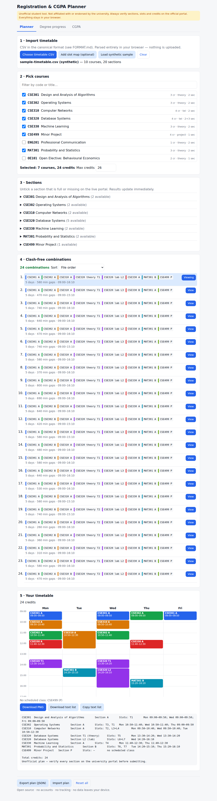
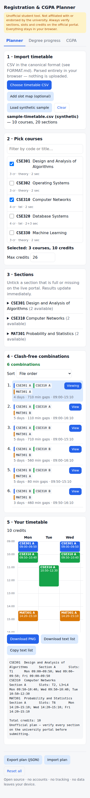
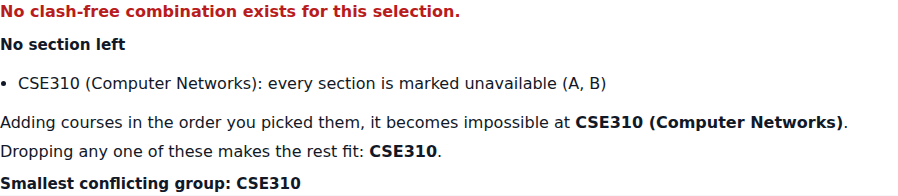
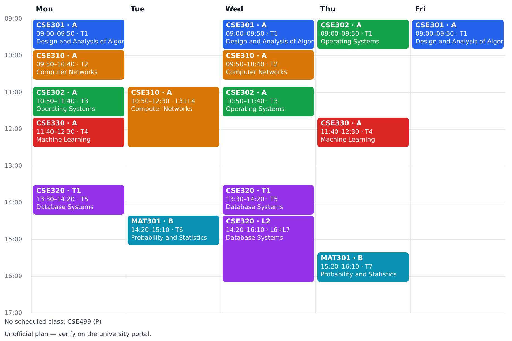
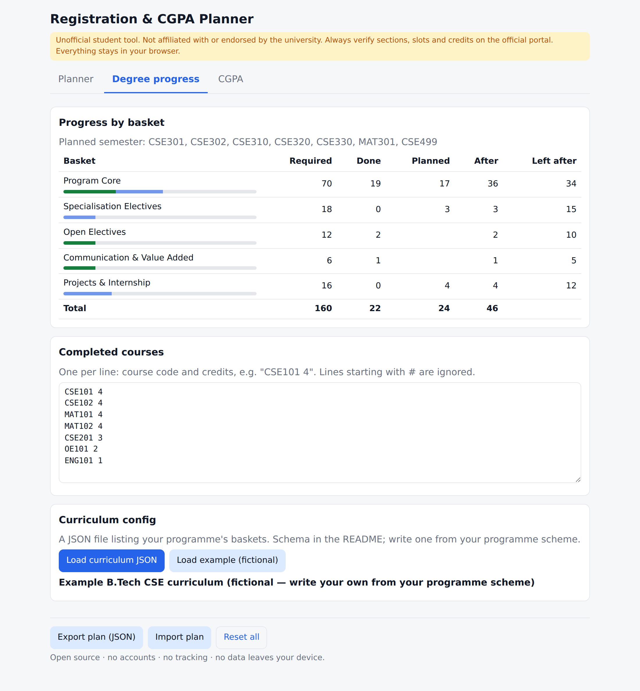
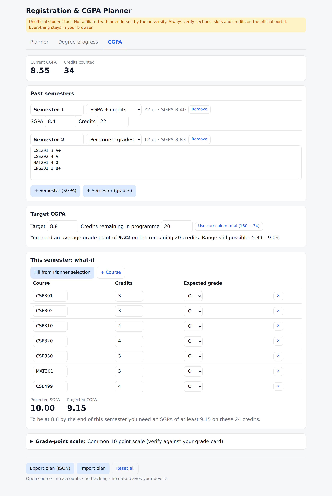

# Registration & CGPA Planner

A client-side tool for planning course registration and CGPA, built with Amity University Bangalore students in mind.

- **Clash checker** – pick courses and it lists every section combination with no clashes. Clashes are found by **real time overlap**, not by comparing slot names.
- **Degree progress** – shows credits per basket (Program Core, electives, …) before and after the semester you're planning.
- **CGPA what-if** – shows your current CGPA, the average you need to hit a target, and a projected CGPA from expected grades.

It's a static site. There's no backend and no account, and nothing you enter or upload leaves your browser.

> ### ⚠️ Disclaimer
> This is an **unofficial** student tool. It is not affiliated with, endorsed by or connected to the university.
> Timetable files go out of date, and the live portal is the only source of truth.
> **Always verify every section, slot, credit value and grade-point rule on the official portal and in your academic regulations before you submit anything.**
> The default grade scale is a common 10-point scale and **may not match yours**. Check it against your own grade card.

---

## Screenshots

| Planner (desktop) | Phone |
|---|---|
|  |  |

| When nothing fits | PNG export |
|---|---|
|  |  |

| Degree progress | CGPA |
|---|---|
|  |  |

All screenshots use the **synthetic** sample in `examples/`. It's made-up data, not a real timetable.

---

## How to use during registration week

**Before the portal opens**

1. Download the **Course Registration File** (.xlsx) as the university publishes it. Don't edit it.
2. Open the planner, click **Choose registration file** and pick it. Slot names are turned into real times using the Fall 2026-27 slot timetable, which is built in. For a later semester, also load that semester's **slot timetable .docx**.
3. Read the import summary. **Skipped rows** are offerings whose times aren't in the file, such as courses with no slot at all. They aren't in the planner, so check them on the portal. **Corrected slot spellings** and **warnings** point to rows worth double-checking.
4. Tick the courses you want. Set **Max credits** to your programme's limit so you get a warning if you go over.
5. Look through the clash-free combinations. Sort by *fewest days*, *fewest gaps*, *latest first class* or *earliest last class*. Click **View** on the ones you like.
6. For the one you'd register with, **Download text list** or **Copy text list**. It has the course code, section and slots for each course, ready to copy into the official form. Save the **PNG** too.
7. Pick a second and third choice now, while you're calm.
8. Click **Export plan (JSON)** so you have a backup that doesn't depend on this browser.

**While registering**

- If a section is full or has disappeared from the portal, open **3 · Sections**, untick it, and the list updates straight away.
- If no combination is left, the tool tells you:
  - which course first made the set impossible (in the order you picked them)
  - which single course you could drop to make the rest fit
  - which pairs of courses can never go together
  - the smallest group of courses that conflict, and the exact sections and times that clash
- Before you submit, check the final list on the portal itself.

**After registering**

- In **Degree progress**, add what you've completed and check that the planned courses land in the right baskets. Any code that isn't in your curriculum is flagged.
- In **CGPA**, enter past semesters and a target to see what average you need.

---

## Features

### 1. Clash checker

- **Import:**
  - the university's **Course Registration File** as published: .xlsx, or a .csv saved from it
  - optionally, the semester's **Slot Timetable** .docx (Fall 2026-27 is built in)
  - as a fallback, this tool's own canonical CSV (one row per class meeting)

  Everything is parsed in the browser. SheetJS, the spreadsheet reader, is downloaded only when you open an .xlsx. [FORMAT.md](FORMAT.md) documents both university files cell by cell, including every irregularity in the Fall 2026-27 file and how the importer treats it.
- **Sections:** the registration file has no section column. So each distinct theory-slot + lab-slot combination is one section, named by its slots (e.g. `A2 · L3+L4`), with the source spreadsheet rows listed so you can find it again.
- **Clash rule:** two classes clash only if they're on the same day and their `[start, end)` intervals overlap.
  - A lab from 10:50–12:30 clashes with a theory class at 10:50–11:40 or 11:40–12:30, even though the slot names differ.
  - Back-to-back classes (10:00–10:50, then 10:50–11:40) don't clash.
  - Project or dissertation courses with no class times never clash.
- **TEL courses:** the theory and lab can share one section, or be picked separately (a theory section plus a lab batch). With separate picks, the solver also makes sure your theory and lab don't clash with each other.
- **Solver:** you pick courses, not sections. The tool searches through every section combination and lists all the clash-free ones. It stores up to 5,000 and counts up to 100,000.
- **Section vanished:** mark any section unavailable and it re-solves straight away.
- **Timetable grid** for the combination you choose, plus **PNG** and **plain-text** export.
- **Credit total** with a max-credit warning you can set.

### 2. Degree progress

- Curriculum config is a JSON file (schema below). A fictional example ships in `examples/curriculum.example.json`.
- Shows credits done, planned and remaining for each basket, before and after the planned semester.
- Flags planned courses that aren't in the curriculum, and planned courses you've already completed.

### 3. CGPA what-if

- Grade scale you can edit (`GRADE points`, one per line). Add `nc` for grades that carry no credit weight.
- Past semesters can be entered as **SGPA + credits** or as **per-course grades**. You can mix both.
- Shows:
  - your current CGPA
  - the **average grade point you need** on your remaining credits to reach a target, flagged as reachable, **not reachable** (needs more than the top grade) or already guaranteed
  - the best and worst final CGPA you can still get
  - a **what-if** for this semester: projected SGPA and CGPA from your expected grades, plus the SGPA you need to hit the target by the end of this semester
- An unknown grade is an error. It never silently counts as 0.

### Your data

- Your plan is saved automatically to `localStorage`. If storage is blocked (private mode, full storage), the app still works and warns you to export.
- **Export plan / Import plan** save and load everything as a JSON file, including the timetable text, your selections, unavailable sections, curriculum, completed courses and CGPA inputs.

---

## Curriculum config

```jsonc
{
  "name": "B.Tech CSE 2023 batch",         // shown in the UI
  "totalCredits": 160,                      // optional; used for "credits remaining" in the CGPA tab
  "baskets": [
    {
      "id": "core",                         // unique, any string
      "name": "Program Core",
      "requiredCredits": 70,
      "courses": ["CSE101", "CSE102", "MAT101"]   // exact codes…
    },
    {
      "id": "oe",
      "name": "Open Electives",
      "requiredCredits": 12,
      "courses": ["OE*"]                    // …or patterns; * matches anything
    }
  ]
}
```

Rules:

- Matching isn't case-sensitive.
- Each course counts toward **exactly one** basket. An exact code listing wins over a `*` pattern. If two baskets still both match, the one listed first wins. So list specific baskets before catch-all ones.
- Credits come from what you enter, never from the config. So a course with different credits in different schemes still works.
- Credits beyond a basket's requirement show as ✓. They don't spill over into other baskets.

To write yours: copy the example, then fill in the baskets and course codes from your programme's scheme of study.

---

## Development

```bash
npm install
npm run dev       # local dev server
npm test          # vitest
npm run build     # typecheck + production build into dist/
```

The dev dependencies are Vite, Vitest, TypeScript and `@types/node`. The only runtime dependency is **SheetJS**, installed from the vendor's tarball on cdn.sheetjs.com rather than the unmaintained npm `xlsx`. It's lazy-loaded into its own chunk. The .docx reader is built in, and the PNG export draws straight onto a canvas.

```
src/core/       pure logic (no DOM): model, time overlap, clash, solver, CGPA, curriculum
src/import/     CSV/zip/docx/xlsx readers, canonical CSV importer
src/import/university/  registration-file importer + slot-grid parser (Fall 2026-27 grid built in)
src/ui/         DOM views (text nodes only; file content is never parsed as HTML)
tests/          vitest suites
examples/       synthetic timetable + fictional curriculum
```

### Tests

- **Time overlap** (`tests/time.test.ts`):
  - a 10:50–12:30 lab against 10:50–11:40 and 11:40–12:30 theory classes with different slot names
  - classes that touch but don't overlap
  - multi-day sections
  - TEL courses (theory + lab)
  - slotless project courses
  - AM/PM handling
  - strict parsing of times and days
- **Solver** (`tests/solver.test.ts`):
  - the combination count matches a brute-force check on a random timetable
  - TEL courses with separate theory and lab picks
  - unavailable sections and re-solving
  - what happens when the result list is cut off
  - every part of the infeasibility report (first course that breaks it, courses you could drop, never-together pairs, smallest conflicting group, the clashing sections, components with no section left)
- **CGPA** (`tests/cgpa.test.ts`):
  - credits-weighted SGPA
  - mixed SGPA and per-course input
  - required average, with reachable, unreachable, exactly-at-max, guaranteed and no-remaining cases
  - custom scales
  - the what-if projection
- **Real university files** (`tests/university.test.ts`, `tests/slotgrid.test.ts`):
  - reads the actual `.docx` and `.xlsx` in `data/`
  - checks every row is accounted for (read, skipped with a reason, or corrected)
  - checks hand-counted section numbers per course
  - checks real clashes: lab `L3+L4` over theory `D1`, and over `TC1` by a partial overlap
  - checks that 12-hour times without AM/PM are read as afternoon
- **Import, curriculum, state:** CSV edge cases, bad rows being rejected, slot-map lookups, basket matching, and the `localStorage` try/catch paths.

### Deploying

`.github/workflows/deploy.yml` runs the tests and the build on every push and pull request, then publishes `dist/` to GitHub Pages from `main`. To turn it on once: **Settings → Pages → Build and deployment → Source: GitHub Actions**. The build uses relative paths, so it works under `/<repo>/`.

---

## What the importer won't guess

Rows where the file doesn't give class times are skipped and listed in the import summary, not guessed. [FORMAT.md](FORMAT.md) §1 names every such row in the Fall 2026-27 file.

No university logos or branding are used.
